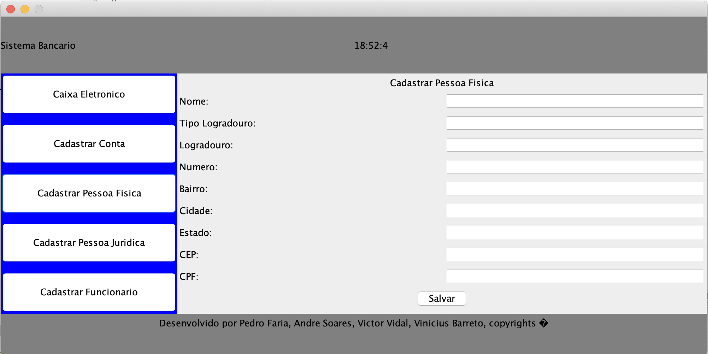

# Trabalho Final POO

Trabalho final da disciplina de POO (Programação Orientada a Objetos) do Curso de Sistemas de Informação da UFG.

## Getting Started

Faça o download do projeto, abra em alguma IDE que rode aplicações JAVA, Eclipse por exemplo, e depois mande executar o código.

## Screenshots

 | Tela 1 | Tela 2 |
 | --------|--------|
 |||
 | Tela 3 | Tela 4 |
 |||
 | Tela 5 |
 ||
